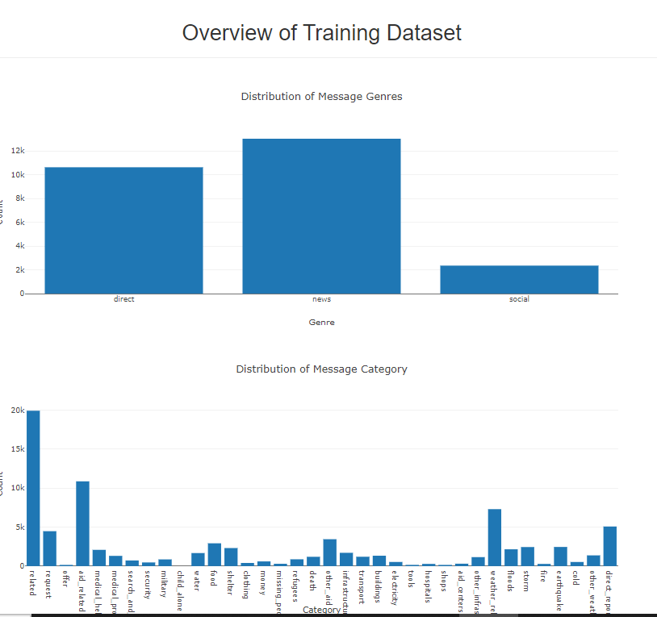
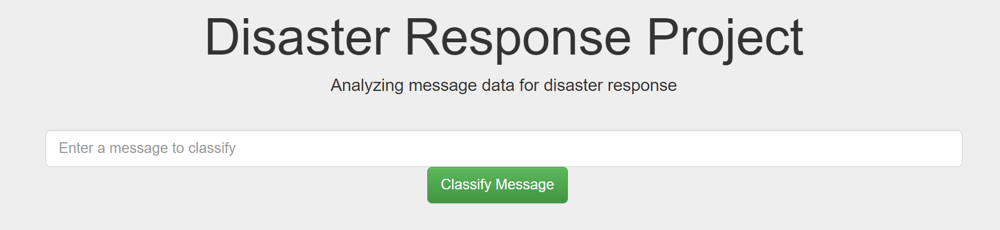
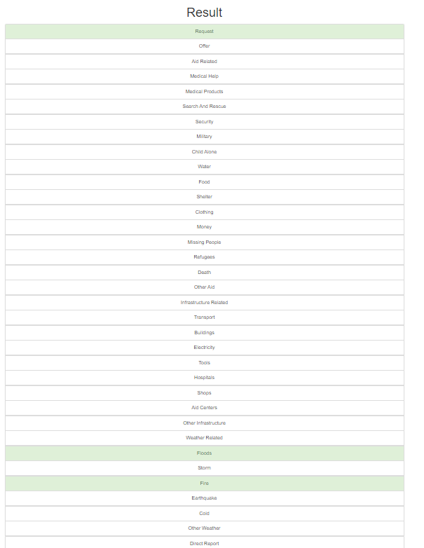

# Disaster Response Pipeline Project

### Introduction:
The project aims to predict the disaster category of the message. The project covers 36 categories, some visualizations graph to ilustrate the distribution of the data. 

*Image 1: The visualization of the dataset.* 

*Image 2: The input box for user input message.*

*Image 3: The category result board*

### Project structure:
- DisasterResponse
    - app
        - templates
            - go.html
            - master.html
        - run.py
    - data
        - disaster_categories.csv
        - disaster_messages.csv
        - process_data.py
    - models
        - train_classifier.py
    - DisasterResponse.db

"app" folder uses to create the web server and UI. Two file html in "templates" folder use to render for user. File run.py use to build the web flask server up.

"data" folder contains two file csv data. File process_data.py use to process data from csv files and create the DisasterResponse.db file. 

"models" folder contains train_classifier.py for training the model.

### Instructions:
1. Run the following commands in the project's root directory to set up your database and model. (When you stand in parent folder - "DisasterResponse")

    - To run ETL pipeline that cleans data and stores in database
        `python data/process_data.py data/disaster_messages.csv data/disaster_categories.csv DisasterResponse.db`
    - To run ML pipeline that trains classifier and saves
        `python models/train_classifier.py DisasterResponse.db classifier.pkl`

2. Run the following command in the app's directory to run your web app.
    `python app/run.py`

3. Go to http://0.0.0.0:3001/
